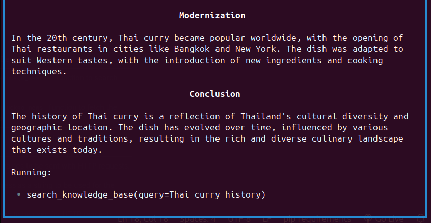
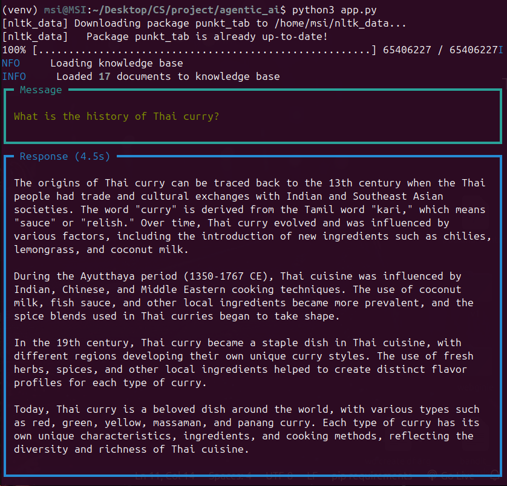

# Agentic AI

## Overview
Agentic AI is an intelligent agent designed for hybrid search and information retrieval. It integrates PineconeDB for vector storage, Google's Gemini for embeddings, and the Groq model for AI-based responses. This project leverages website knowledge bases and search tools to provide comprehensive answers.

## Features
- **Hybrid Search**: Utilizes PineconeDB with Gemini embeddings.
- **Knowledge Base**: Extracts and processes information from specified websites.
- **AI-Powered Responses**: Uses the Groq model for intelligent answers.
- **Search Tools**: Incorporates DuckDuckGo search for additional sources.
- **Agentic Capabilities**: Structured response handling with streaming output.
- **Latest Information Retrieval**: Uses DuckDuckGoTools to fetch real-time data from the web.
### Sample Outputs





## Installation
1. Clone the repository:
   ```sh
   git clone <repository-url>
   cd agentic-ai
   ```
2. Install dependencies:
   ```sh
   pip install -r requirements.txt
   ```
3. Set up environment variables:
   Create a `.env` file and add your API keys:
   ```env
   PINECONE_API=<your_pinecone_api_key>
   GROQ_API_KEY=<your_groq_api_key>
   GEMINI_API_KEY=<your_gemini_api_key>
   ```

## Usage
Run the agent with the following command:
```sh
python agent.py
```
Example query:
```python
agent.print_response("What is the history of Thai curry?", stream=True, markdown=True)
```

## Code Explanation
### Initialization
- **Loading API Keys**: Environment variables are loaded via `dotenv`.
- **Embedding Model**: `GeminiEmbedder` is used for text embeddings.
- **Vector Database**: `PineconeDB` stores embeddings and enables hybrid search.
- **Knowledge Base**: `WebsiteKnowledgeBase` fetches relevant information.
- **Agent**: Uses the `Groq` model for AI-based answers and integrates search tools.
- **Real-Time Search**: `DuckDuckGoTools` is used to retrieve the latest information from the web.

## Contributing
Feel free to contribute by opening a pull request or reporting issues!

## License
This project is licensed under the MIT License.